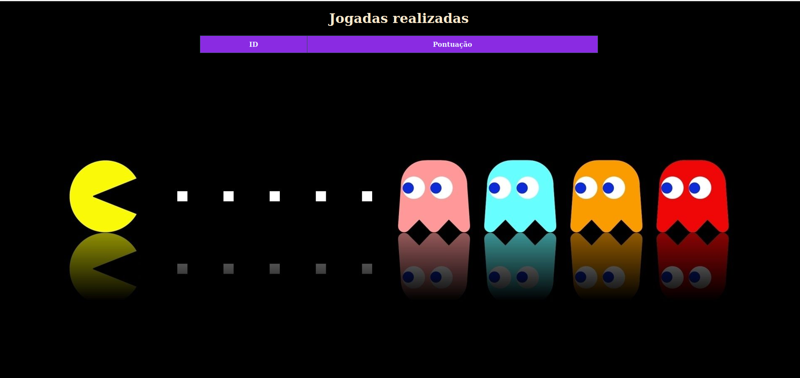

# Descrição
 O jogo funciona com o objetivo que você controla o PacMan, para comer todas as bolinhas pequenas do mapa para ganhar o jogo, as bolinhas com o tamanho médio deixam os fantasmas em cores azulzinhos, assim você pode comer os fantasmas e ganhar uma boa pontuação. O PacMan pode ser controlado nas setas do teclado. Quando você quiser fechar o jogo, quando ganhar ou perder, você aperta a tecla S para fechar e salvar sua pontuação no Banco de Dados.

# Ferramentas
 Foi utilizado o Gimp para a edição da imagem e o corte da imagem para ficar no formato certo e a Inteligencia Artificial do Canva para a criação da Imagem.
 Foi usado o CSS para embelezar a página
 Foi utilizado a ferramenta de captura de tela para dar o screenshot de como ficou o front-end editado

